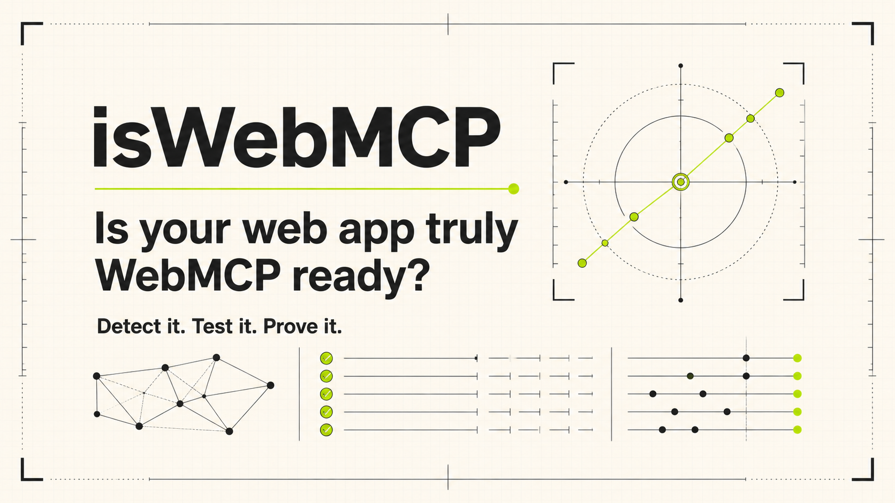

# isWebMCP

> **isWebMCP** is an evidence-based before-and-after laboratory for agent-ready web applications. It distinguishes source hints from runtime proof, maps an application's action surface, evaluates WebMCP tool contracts, and measures whether WebMCP actually improves a representative user journey.



**Detect it. Test it. Prove it.**

The product answers a harder question than protocol detection: can an agent use the exposed tools successfully, safely, and with an observable improvement over the human UI path?

## What works

- **Quick Scan** performs a bounded, unauthenticated fetch of public HTML or plain text, inventories semantic controls, and reports source evidence without executing target JavaScript.
- **Evidence reports** keep baseline actionability, WebMCP implementation quality, and measured WebMCP Lift separate. Unknown evidence stays unknown.
- **Imported contract evidence** accepts a sanitized tool inventory, retains only bounded schema summaries, labels its provenance, and creates an immutable derived report.
- **Proof Lab** runs the same synthetic headset task through an accessible UI-only path and a WebMCP tool path backed by the same state and services.
- **Contract Workbench** provides deterministic feedback on tool names, descriptions, schemas, annotations, and source-visible state/verification signals.
- **Exports** include normalized JSON and print-friendly reports without requiring an account.

## Measurements

| Measurement                   |     Range | Available when                                                       |
| ----------------------------- | --------: | -------------------------------------------------------------------- |
| Baseline Actionability        |     0–100 | Source-visible UI evidence exists                                    |
| WebMCP Implementation Quality |     0–100 | Imported or runtime tool evidence exists                             |
| WebMCP Lift                   | −100…+100 | Paired, completed runs use the same fixture, task, and evidence mode |

Baseline Actionability weights semantic structure (20), accessible names (20), form clarity (20), state feedback (15), entities (15), and transport (10). WebMCP Lift weights success (40%), action reduction (20%), elapsed reduction (15%), invalid attempts (10%), human intervention (10%), and verification (5%). Efficiency components are ignored if either journey fails.

The controlled replay is deterministic product evidence, not a model-selection evaluation. See [methodology](docs/architecture.md) and the in-app Methodology page for the complete counting rules and limitations.

## WebMCP tool inventory

The top-level application feature-detects `document.modelContext.registerTool` and registers tools with route-aware `AbortSignal` cleanup. All handlers validate untrusted input and use the same application services as the visible UI.

| Tool                       | Purpose                                                 |
| -------------------------- | ------------------------------------------------------- |
| `scan_public_url`          | Run a source-only public scan and open its report       |
| `get_scan_summary`         | Read scores, evidence, limitations, and recommendations |
| `list_action_surface`      | List inferred actions and coverage classes              |
| `get_finding_details`      | Read one finding with its supporting evidence           |
| `select_demo_mode`         | Reset and select baseline or WebMCP lab mode            |
| `start_demo_run`           | Start the supported synthetic journey                   |
| `search_demo_products`     | Filter the synthetic catalog and update visible state   |
| `compare_demo_products`    | Compare two to four stable product IDs                  |
| `add_demo_product_to_cart` | Add a synthetic item; no purchase occurs                |
| `finish_demo_run`          | Verify deterministic postconditions                     |
| `compare_demo_runs`        | Calculate WebMCP Lift from paired completed runs        |
| `export_current_report`    | Prepare a visible JSON or print export                  |

The three catalog tools are exposed only on the Proof Lab in WebMCP mode. The application remains fully usable when WebMCP is unavailable.

## Run locally

Prerequisites: Node.js 22.13 or newer and npm.

```bash
npm ci
npm run dev
```

Open the URL printed by the development server. No environment variables, accounts, model API, or target-site credentials are required.

### Quality gates

```bash
npm run typecheck
npm run lint
npm test
npm run build
npx playwright install chromium
npm run test:e2e
```

Additional commands:

- `npm run format:check` checks formatting.
- `npm run format` applies the repository formatter.
- `npm run start` runs the built Cloudflare Worker locally.

## Architecture

The app uses React 19, TypeScript, Vinext, Vite, Tailwind CSS, Zod, Vitest, Playwright, and Cloudflare's Worker runtime. It is deliberately account-free and deterministic.

```text
Browser UI / WebMCP tools
          │
          ├── shared scan, report, demo, scoring, and export services
          │
          ├── Quick Scan API ── public-source fetch boundary
          │
          └── ephemeral normalized report store
```

Detailed design is in [docs/architecture.md](docs/architecture.md). Security assumptions and abuse cases are in [docs/threat-model.md](docs/threat-model.md).

## Security and evidence boundaries

- Quick Scan accepts only absolute HTTP(S) URLs, rejects credentials and nonstandard ports, checks A and AAAA records before every redirect hop, blocks private/reserved/special-purpose addresses, omits cookies and authorization, and caps time, redirects, response size, concurrency, and rates.
- Cloudflare's outbound Worker fetch proxy is designed to reach public Internet services rather than internal services. The app still documents its DNS preflight limitation: Worker `fetch` resolves independently, so application code cannot cryptographically pin the connection to the preflight address. A deployment requiring an address-pinned SSRF guarantee needs controlled egress or equivalent network policy.
- Fetched markup is untrusted input. It is analyzed in memory, never rendered as HTML, and complete target HTML is not retained in reports.
- Imported manifests are user supplied and **not independently verified**. Raw defaults, examples, enums, credentials, and extension payloads are not retained.
- Report storage, rate counters, and concurrency counters are ephemeral and isolate-local in this MVP.

Please report security issues using the process in [SECURITY.md](SECURITY.md).

## Manual WebMCP verification

The WebMCP proposal is experimental and not a W3C Standard. Browser support and APIs can change. Follow [docs/manual-webmcp-test.md](docs/manual-webmcp-test.md) in a current supported Chrome or ChatGPT browser environment, then retain the date, browser/model version, visible state, and tool trace with the release evidence.

Authoritative references:

- [WebMCP Community Group draft](https://webmachinelearning.github.io/webmcp/)
- [WebMCP specification repository](https://github.com/webmachinelearning/webmcp)
- [Chrome WebMCP documentation](https://developer.chrome.com/docs/ai/webmcp/)
- [Web Platform Tests](https://wpt.fyi/results/webmcp)

## Deployment

The production target is OpenAI Sites on Cloudflare. Build configuration lives in `.openai/hosting.json`; deployment identifiers are managed by the hosting workflow. A custom domain can be attached after the generated deployment is healthy.

## Challenge submission kit

- [Manual verification checklist](docs/manual-webmcp-test.md)
- [Under-three-minute demo script](docs/demo-script.md)
- [Devpost draft](docs/devpost-draft.md)
- [Submission checklist](docs/challenge-checklist.md)

The owner requested a **private** GitHub repository for this build. The WebMCP Challenge calls for a public repository with a visible open-source license, so the checklist intentionally keeps “make the repository public” open; the project must not claim challenge eligibility until that step is completed.

## License

[MIT](LICENSE). isWebMCP is an independent project and is not an official OpenAI, Google, Microsoft, Chrome, Cloudflare, or W3C product.
