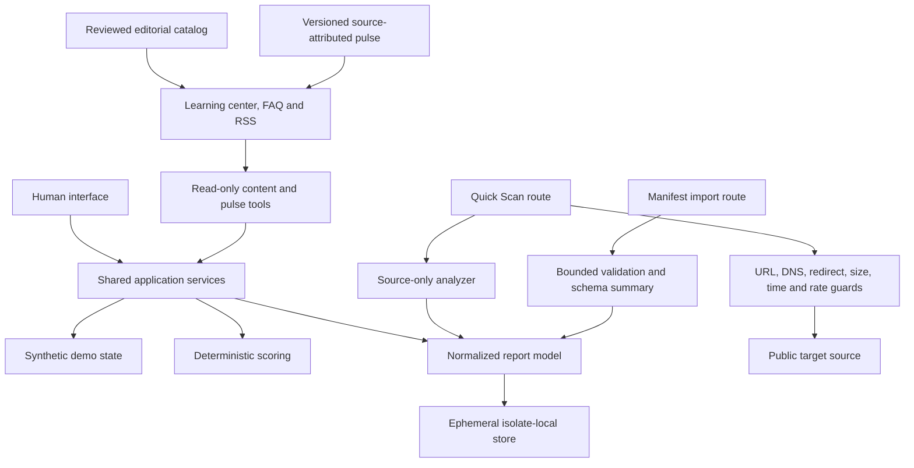

# Architecture

## Product boundary

isWebMCP is one web application with seven connected surfaces:

1. Landing and Quick Scan
2. Evidence-based reports
3. Before/After Proof Lab
4. Tool Contract Workbench
5. Learning Center and detail guides
6. WebMCP FAQ
7. WebMCP Pulse and Challenge Pulse

The browser UI and WebMCP handlers call the same domain services. There is no second “agent-only” state model.

## Runtime stack

- React 19 and TypeScript for UI and domain logic
- Vinext and Vite for Next-compatible routing and Cloudflare output
- Tailwind CSS and Base UI primitives for presentation and accessible controls
- Zod plus explicit exact-record checks for API and tool inputs
- Vitest for unit/integration coverage
- Playwright for browser journeys and direct deterministic WebMCP execution
- OpenAI Sites/Cloudflare Workers as the publishing runtime

## Request flows

### Quick Scan

1. The same-origin API admits a small JSON body and charges the caller rate before parsing it.
2. The URL parser accepts only HTTP(S), no credentials, and standard ports.
3. Every initial and redirected hostname is host-rate-limited and resolved through A and AAAA checks.
4. Private, local, reserved, documentation, multicast, metadata, and special-use destinations fail closed.
5. Manual redirects, hop and total deadlines, exact textual MIME types, a 640 KB body cap, and a neutral scanner identity bound the fetch.
6. The analyzer removes executable/example-only regions from visible analysis, extracts semantic evidence, calculates only supported metrics, and discards complete target HTML.
7. The normalized report is stored for 15 minutes in the current isolate.

Quick Scan does not execute JavaScript, authenticate, inspect shadow DOM, or cross the browser same-origin boundary. A source occurrence of `document.modelContext` or `registerTool` is a hint, not runtime proof.

### Imported manifest

1. A visible report ID and a JSON manifest are submitted to the same-origin import endpoint.
2. The server limits bytes, tool count, depth, nodes, key names, and credential-like material.
3. Only tool names, bounded descriptions, annotations, and schema summaries survive normalization.
4. The audit scores only observed naming, schema, coverage, and safety dimensions. Output/state/recovery claims remain unobserved.
5. A new report is derived with `parentReportId`; the original report is unchanged.

An envelope claiming `same_origin_probe` provenance must match the scanned page origin and include its capture metadata. That validates consistency, not truth. All imported evidence remains labeled “not independently verified.”

### Proof Lab

Both modes use the same synthetic catalog, task definition, visible UI, state reducer, action constraints, and deterministic assertions.

- Baseline mode records committed semantic UI operations.
- WebMCP mode additionally registers structured search, comparison, and cart tools on the top-level page.
- The same ordered postconditions—eligible results, comparison, selected product, visible cart, quantity, and no checkout—must pass.
- WebMCP Lift is computed only for a paired fixture/task/evidence mode with completed UI-only and tool-only runs.

Controlled replay uses fixed events to demonstrate measurement and state synchronization. It is not a claim about probabilistic model selection quality.

## WebMCP lifecycle

Core tools are feature-detected and registered by the top-level application provider. The report readers refuse to return a report that does not match the visible report route. The three catalog tools register only on `/lab` in WebMCP mode. Four read-only tools expose the reviewed learning library, labeled pulse, and challenge aggregate across routes. Each registration group receives an `AbortSignal`; changing route or mode aborts the group and removes stale capabilities.

Every handler:

- rejects unknown parameters;
- validates type, range, enum, array size, and required fields at runtime;
- returns structured expected errors;
- updates visible state through shared services;
- truthfully annotates read-only behavior;
- avoids external purchase or irreversible effects.

## Editorial and pulse flow

Evergreen resources are typed, reviewed block data rather than remote HTML or executable MDX. Detail pages render paragraphs, lists, code, notes, and citations through React. Each article includes a stable slug, review date, audience, estimated reading time, status-aware language, direct primary references, and related-resource links.

The pulse is a versioned JSON snapshot with separate `publishedAt`, `observedAt`, source, topic, and status fields. The site does not fetch external feeds during a visitor request. An external hourly maintenance task may examine approved machine-readable official feeds, but it updates the checked-in snapshot only for a material, source-verified change and only after the release gates pass. No-change checks produce no commit or deployment.

Devpost is deliberately different: its public aggregate is a timestamped manual observation. Participant identities require login, the project gallery is not yet published, and Devpost's terms prohibit automated scraping. The site never infers a submission total from a participant counter.

The learning and pulse catalog is exposed through server-rendered pages, `/api/content`, `/feed.xml`, and four read-only WebMCP tools. `/sitemap.xml` includes durable public content but excludes ephemeral reports and APIs.

## Storage and scale

The current report store, rate windows, and concurrency counter live in isolate memory. This is intentional for an account-free challenge MVP, but it means reports can expire or disappear across isolates/deployments and rate enforcement is not globally coordinated. A multi-region production service should replace these with durable storage, a global rate-limit primitive, and controlled outbound egress.

Editorial history is durable through Git rather than isolate memory. A larger publishing operation could move feed history, review workflow, and correction records to D1, but the current version favors a small auditable source catalog over an always-on ingestion database.
